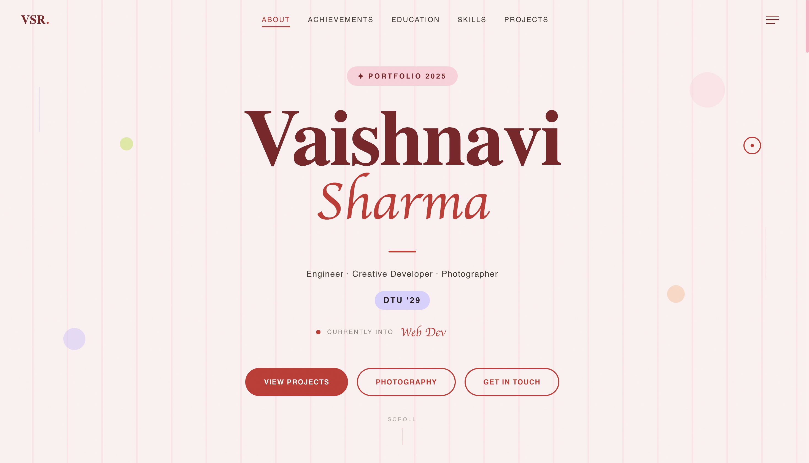

# Vaishnavi Sharma Portfolio

Personal portfolio website for showcasing my projects, skills, education, creative work, and photography.

Built with **Next.js**, **TypeScript**, **Tailwind CSS**, **Framer Motion**, and **GSAP**.

## Preview



## Live Demo

[View Portfolio](https://portfolio-vaishnavi-sharma-virid.vercel.app/)

## About

I am Vaishnavi Sharma, a second-year Computer Science Engineering student at Delhi Technological University.

This portfolio is designed to present both sides of my work: technical projects built with engineering logic, and creative work shaped through design, photography, and visual storytelling.

## Features

- Interactive landing page
- Animated navigation and custom cursor
- Smooth scrolling experience
- Project showcase section
- Skills and education sections
- Dedicated photography gallery
- Responsive layout for desktop and mobile

## Tech Stack

| Area | Tools |
|---|---|
| Framework | Next.js App Router |
| Language | TypeScript |
| Styling | Tailwind CSS |
| Animations | Framer Motion, GSAP |
| Icons | Lucide React |
| Deployment | Vercel |

## Featured Sections

### Projects

Highlights selected technical projects including web apps, ML demos, and hackathon builds.

### Skills

Grouped technical skills across frontend development, machine learning, tools, and creative software.

### Photography

A dedicated gallery for selected photography work with categories and lightbox viewing.

## Run Locally

```bash
## Run Locally

```bash
git clone https://github.com/vaishnavifrsharma/Portfolio-Vaishnavi-Sharma.git
cd Portfolio-Vaishnavi-Sharma
npm install
npm run dev

Then open:

http://localhost:3000
Project Structure
src/
├── app/
│   ├── page.tsx
│   ├── globals.css
│   └── photography/
│       └── page.tsx
├── components/
│   ├── Navigation.tsx
│   ├── CustomCursor.tsx
│   ├── SmoothScroll.tsx
│   └── ...

Future Improvements
Add detailed case-study pages for major projects
Add more screenshots and demo GIFs
Improve SEO metadata and Open Graph preview
Add accessibility improvements for reduced motion users
Make more content server-rendered for better crawlability
Connect
GitHub: vaishnavifrsharma
LinkedIn: Vaishnavi Sharma
Email: Contact Me

Designed and built by Vaishnavi Sharma.